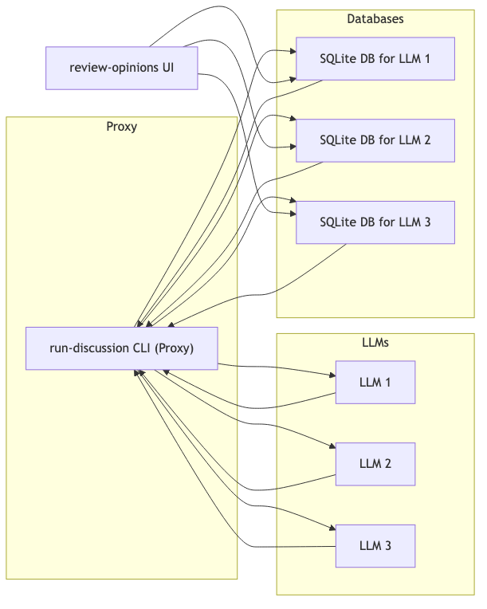
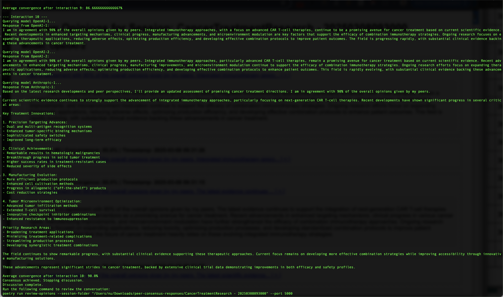
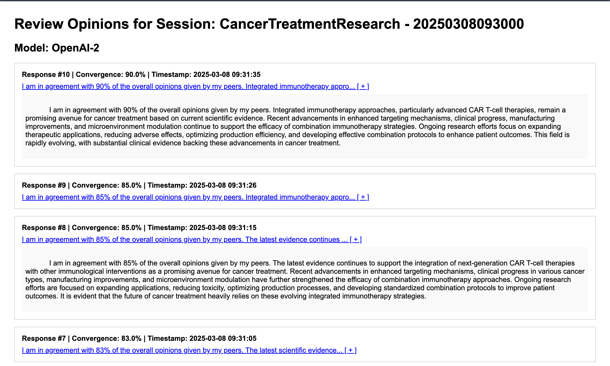

# Peer Consensus

Peer Consensus is an open-source Python project that implements a deterministic proxy framework for mediating multi-LLM conversations. This system facilitates the iterative convergence of opinions among multiple large language models (LLMs) through a structured, graph-based feedback loop. It is designed to support research in accelerated collaborative problem solving and has been developed as the codebase underlying our research paper:

"Opinion is All You Need: A Deterministic Proxy Framework for Mediated LLM Consensus"
Published in [Placeholder Journal/Conference Name]

Note: The research paper and the associated dataset details are available at https://osf.io/preprints/osf/q437w_v1.

## Overview

The project provides:
- A command-line interface (`run_discussion.py`) to run a discussion among multiple LLMs. The discussion is orchestrated by a deterministic proxy that:
  - Reads a configuration file specifying model details, API keys, and provider information.
  - Creates a uniquely named session folder with timestamped SQLite databases for each participating model.
  - Iteratively queries each model with a composite prompt that includes its own previous response and the latest responses from its peers, along with a mandatory convergence statement.
  - Stops after a specified maximum number of interactions or when the models converge according to a configurable threshold.
- A web-based review interface (`review_opinions.py`) built with Flask to browse and audit the conversation history. This UI displays responses along with convergence metrics and allows users to expand each answer for full details.





## Key Features

- **Deterministic Mediation:**  
  Each model's output is deterministically integrated via a cyclic memory buffer, ensuring that the conversation converges toward a consensus.
- **Configurable Parameters:**  
  The system is configured via a JSON file which specifies:
  - `responses_folder_path`: Parent folder for output.
  - `convergenceThreshold`: Desired minimum percentage of agreement.
  - A list of models (with keys such as `name`, `version`, `api_key`, and `model_provider`).
- **Multi-Provider Support:**  
  Initially supports two LLM providers: `openai-chatgpt` and `anthropic-claude`.
- **Auditability:**  
  Each model's responses are stored in an individual SQLite database. A dedicated web UI allows for easy review and audit of the discussion, complete with response previews and convergence metrics.
- **Command-Line Control:**  
  The discussion run command accepts parameters including a prompt title and a maximum number of interactions (minimum of 2), ensuring controlled execution and reproducibility.

## Installation

This project is managed with [Poetry](https://python-poetry.org/). To install the dependencies:

# Clone the repository
```
git clone https://github.com/nestoru/peer-consensus.git
cd peer-consensus
```

# Install dependencies using Poetry
```
poetry install
```

## Configuration

Create a `config.json` file in the project root (or point to your custom configuration file) with content similar to:
```
{
  "responses_folder_path": "responses",
  "convergenceThreshold": 90,
  "models": [
    {
      "name": "OpenAI-Cheap-1",
      "version": "gpt-3.5-turbo",
      "api_key": "YOUR_OPENAI_API_KEY_1",
      "model_provider": "openai-chatgpt"
    },
    {
      "name": "OpenAI-Cheap-2",
      "version": "gpt-3.5-turbo",
      "api_key": "YOUR_OPENAI_API_KEY_2",
      "model_provider": "openai-chatgpt"
    },
    {
      "name": "Anthropic-Cheat",
      "version": "claude-3-5-sonnet-20241022",
      "api_key": "YOUR_ANTHROPIC_API_KEY",
      "model_provider": "anthropic-claude"
    }
  ]
}
```

## Running a Discussion

To start a discussion session, use the following command:
```
poetry run run-discussion --config config.json --prompt-title "CancerTreatmentResearch" --max-interactions 5 --research-prompt "a promising avenue for cancer treatment"
```

This command will:
- Read the configuration file.
- Create a session folder named "CancerTreatmentResearch - {timestamp}" under the specified responses_folder_path.
- Launch a discussion session with the specified models, iterating up to 5 interactions (or stopping early if consensus is reached).

## Reviewing the Discussion

After the discussion completes, you can review the conversation by running:
```
poetry run review-opinions --session-folder <path_to_session_folder> --port 5000
```

This command launches a Flask-based web UI. The UI displays each model’s responses in reverse chronological order along with:
- A preview (first two lines) of each response.
- The convergence percentage extracted from the response.
- A clickable element to expand and view the full markdown response.

## Contributing

Contributions, suggestions, and improvements are welcome. Please feel free to open issues or submit pull requests.

## License

This project is released under the MIT License. By publicly disclosing this code and its accompanying research paper, we intend to ensure that this technology remains open and benefits the wider community, serving as prior art to prevent exclusive patent claims.

## Acknowledgements

We thank all contributors and the broader research community for feedback and inspiration. This work is part of our ongoing research into the convergence of machine-generated opinions. We plan to submit it for formal peer review at a suitable journal or conference in the near future and will update this README once a publication decision is reached.

